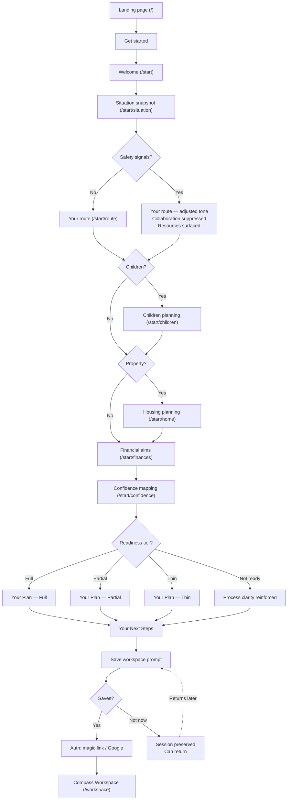
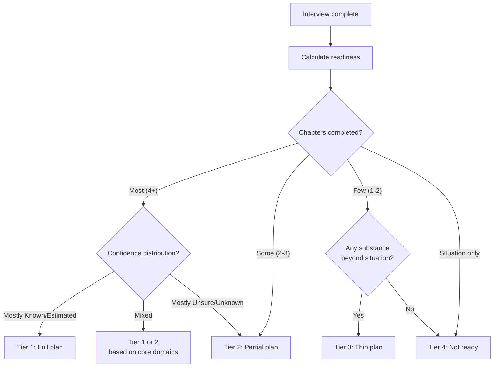
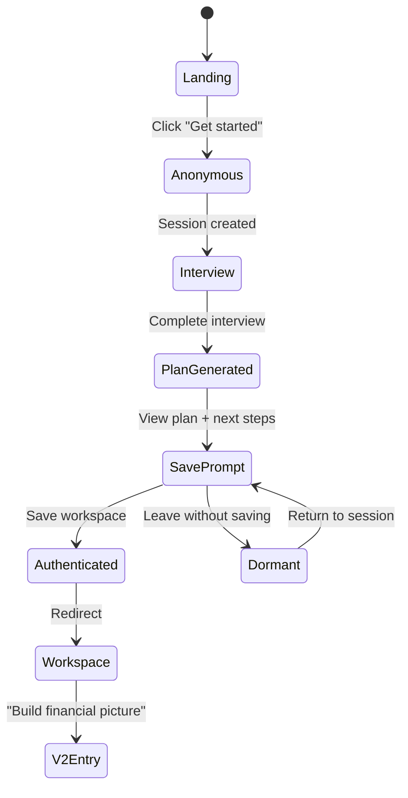

# V1 Diagrams and Wireframes

## User journey flow



## Adaptive output decision flow



## Gentle Interview → Compass Workspace transition

```mermaid
flowchart LR
    subgraph interview["Gentle Interview"]
        direction TB
        S1["Situation"] --> S2["Route"]
        S2 --> S3["Children"]
        S3 --> S4["Home"]
        S4 --> S5["Finances"]
        S5 --> S6["Confidence"]
        S6 --> S7["Plan"]
        S7 --> S8["Next Steps"]
    end

    subgraph transition["Save + Auth"]
        S8 --> AUTH["Magic link\nor Google"]
    end

    subgraph workspace["Compass Workspace"]
        direction TB
        RM["Route Map\n(sidebar)"]
        W1["Route card"]
        W2["Children cards"]
        W3["Housing cards"]
        W4["Finance cards"]
        W5["Confidence map"]
        W6["Plan summary"]
        W7["Next steps"]
        V2["V2 entry →"]
    end

    AUTH --> workspace
```



## Session state transitions



---

## ASCII wireframes

### Landing page (`/`)

```
┌─────────────────────────────────────────────────────┐
│  Decouple                          Features  Pricing│
├─────────────────────────────────────────────────────┤
│                                                     │
│              Separation doesn't have                │
│              to feel overwhelming.                  │
│                                                     │
│       Understand the process. Shape a plan.         │
│       Know what to do next.                         │
│                                                     │
│              ┌─────────────────┐                    │
│              │   Get started   │                    │
│              └─────────────────┘                    │
│          No sign-up needed. Takes ~25 min.          │
│                                                     │
├─────────────────────────────────────────────────────┤
│                                                     │
│  How it works                                       │
│                                                     │
│  ┌──────────┐  ┌──────────┐  ┌──────────┐          │
│  │  1. Tell  │  │ 2. See   │  │ 3. Get   │          │
│  │  us your  │  │ your     │  │ your     │          │
│  │  situation│  │ route    │  │ plan     │          │
│  └──────────┘  └──────────┘  └──────────┘          │
│                                                     │
├─────────────────────────────────────────────────────┤
│                                                     │
│  Your information is private and encrypted.         │
│  Nothing is shared unless you choose.               │
│                                                     │
├─────────────────────────────────────────────────────┤
│  Privacy · Terms · Cookies                          │
└─────────────────────────────────────────────────────┘
```

### Welcome screen (`/start`)

```
┌─────────────────────────────────────────────────────┐
│  Decouple                                           │
├─────────────────────────────────────────────────────┤
│                                                     │
│                                                     │
│        Let's build a clear picture of               │
│        where you are and what comes next.           │
│                                                     │
│                                                     │
│        In the next 20-30 minutes, you'll:           │
│                                                     │
│        ✓ See the likely process for your            │
│          specific situation                         │
│                                                     │
│        ✓ Shape a starting plan for children,        │
│          housing, and finances                      │
│                                                     │
│        ✓ Know exactly what to focus on next         │
│                                                     │
│                                                     │
│        You don't need to know everything.           │
│        You just need to start.                      │
│                                                     │
│              ┌─────────────────┐                    │
│              │   Let's begin   │                    │
│              └─────────────────┘                    │
│                                                     │
└─────────────────────────────────────────────────────┘
```

### Interview step — example: situation (`/start/situation`)

```
┌─────────────────────────────────────────────────────┐
│  ── ── ── ●─ ── ── ── ── ──    Step 1 of 8         │
├─────────────────────────────────────────────────────┤
│                                                     │
│        Your situation                               │
│                                                     │
│        Are you married or in a civil partnership?   │
│                                                     │
│        ┌─────────────┐  ┌─────────────┐            │
│        │   Married   │  │    Civil    │            │
│        │             │  │ partnership │            │
│        └─────────────┘  └─────────────┘            │
│        ┌─────────────┐  ┌─────────────┐            │
│        │  Cohabiting │  │    Other    │            │
│        │             │  │             │            │
│        └─────────────┘  └─────────────┘            │
│                                                     │
│        ┌ ─ ─ ─ ─ ─ ─ ─ ─ ─ ─ ─ ─ ─ ─ ┐           │
│          Why we ask: This helps us show             │
│        │ you the right process. Divorce  │          │
│          and dissolution have specific              │
│        │ legal steps.                    │          │
│        └ ─ ─ ─ ─ ─ ─ ─ ─ ─ ─ ─ ─ ─ ─ ┘           │
│                                                     │
│                                         Continue →  │
│                                                     │
└─────────────────────────────────────────────────────┘
```

### Confidence mapping (`/start/confidence`)

```
┌─────────────────────────────────────────────────────┐
│  ── ── ── ── ── ── ●─ ── ──    Step 7 of 8         │
├─────────────────────────────────────────────────────┤
│                                                     │
│        What do you know and not know?               │
│                                                     │
│        Most people have a mix. That's normal.       │
│                                                     │
│  ┌───────────────────────────────────────────┐      │
│  │  My income                    [ Known  ▾] │      │
│  ├───────────────────────────────────────────┤      │
│  │  Partner's income             [ Unsure ▾] │      │
│  ├───────────────────────────────────────────┤      │
│  │  Savings & bank accounts      [Estimated▾]│      │
│  ├───────────────────────────────────────────┤      │
│  │  Debts & loans                [ Known  ▾] │      │
│  ├───────────────────────────────────────────┤      │
│  │  Property value               [Estimated▾]│      │
│  ├───────────────────────────────────────────┤      │
│  │  Mortgage details             [ Known  ▾] │      │
│  ├───────────────────────────────────────────┤      │
│  │  My pension(s)                [ Unsure ▾] │      │
│  ├───────────────────────────────────────────┤      │
│  │  Partner's pension(s)         [Unknown ▾] │      │
│  ├───────────────────────────────────────────┤      │
│  │  Other assets                 [Unknown ▾] │      │
│  ├───────────────────────────────────────────┤      │
│  │  Regular commitments          [ Known  ▾] │      │
│  └───────────────────────────────────────────┘      │
│                                                     │
│        You can see where the gaps are — and         │
│        that's powerful information in itself.        │
│                                                     │
│                                         Continue →  │
└─────────────────────────────────────────────────────┘
```

### Your Plan — full tier (`/start/plan`)

```
┌─────────────────────────────────────────────────────┐
│  ── ── ── ── ── ── ── ●─ ──    Step 8 of 8         │
├─────────────────────────────────────────────────────┤
│                                                     │
│        Your plan                                    │
│                                                     │
│  ┌───────────────────────────────────────────┐      │
│  │  YOUR ROUTE                               │      │
│  │  Divorce → MIAM → Mediation likely →      │      │
│  │  Financial remedy → Consent order         │      │
│  │  Child arrangements to agree in parallel  │      │
│  └───────────────────────────────────────────┘      │
│                                                     │
│  ┌───────────────────────────────────────────┐      │
│  │  CHILDREN            Confidence: ● Strong │      │
│  │  You're aiming for roughly equal time,    │      │
│  │  keeping their school unchanged.          │      │
│  └───────────────────────────────────────────┘      │
│                                                     │
│  ┌───────────────────────────────────────────┐      │
│  │  HOUSING             Confidence: ◐ Mixed  │      │
│  │  You'd like to stay in the home. This     │      │
│  │  depends on the financial picture — the   │      │
│  │  next step will help clarify.             │      │
│  └───────────────────────────────────────────┘      │
│                                                     │
│  ┌───────────────────────────────────────────┐      │
│  │  FINANCES            Confidence: ○ Gaps   │      │
│  │  Fair split matters most. Pension and     │      │
│  │  partner's finances are unknowns.         │      │
│  └───────────────────────────────────────────┘      │
│                                                     │
│  ┌───────────────────────────────────────────┐      │
│  │  CONFIDENCE MAP                           │      │
│  │  Known: 4  Estimated: 2  Unsure: 2       │      │
│  │  Unknown: 2                               │      │
│  │  ████████████░░░░░░░░░░░░░░               │      │
│  └───────────────────────────────────────────┘      │
│                                                     │
│  ┌─────────────┐                                    │
│  │ Download PDF │                                   │
│  └─────────────┘                                    │
│                                                     │
│  You've built a strong starting position.           │
│                                         Continue →  │
└─────────────────────────────────────────────────────┘
```

### Compass Workspace (`/workspace`) — desktop

```
┌──────────────────────────────────────────────────────────────────┐
│  Decouple                                          Profile  ⚙   │
├──────────────┬───────────────────────────────────────────────────┤
│              │                                                   │
│  ROUTE MAP   │  YOUR WORKSPACE                                   │
│              │                                                   │
│  ✓ Situation │  ┌─────────────────────────────────────────────┐  │
│  ✓ Route     │  │  YOUR PLAN              [View] [Download]   │  │
│  ✓ Children  │  │  3 areas covered · 4 known · 2 unknown     │  │
│  ✓ Home      │  └─────────────────────────────────────────────┘  │
│  ✓ Finances  │                                                   │
│  ✓ Confidence│  Your children ─────────────────────────────────  │
│              │  ┌──────────────────┐  ┌──────────────────┐      │
│  ─ ─ ─ ─ ─  │  │ Current: shared  │  │ Aim: equal time  │      │
│              │  │ ● Known          │  │ ● Known          │      │
│  ○ Financial │  │ [Edit]           │  │ [Edit]           │      │
│    picture   │  └──────────────────┘  └──────────────────┘      │
│  ○ Evidence  │                                                   │
│  ○ Disclosure│  Your home ─────────────────────────────────────  │
│  ○ Sharing   │  ┌──────────────────┐  ┌──────────────────┐      │
│  ○ Outputs   │  │ Own jointly      │  │ Aim: stay        │      │
│              │  │ ● Known          │  │ ◐ Estimated      │      │
│              │  │ [Edit]           │  │ [Edit]           │      │
│              │  └──────────────────┘  └──────────────────┘      │
│              │                                                   │
│              │  Your finances ──────────────────────────────────  │
│              │  ┌──────────────────┐  ┌──────────────────┐      │
│              │  │ Priority: fair   │  │ Concern: pension │      │
│              │  │ split            │  │ unknown          │      │
│              │  │ [Edit]           │  │ ○ Unknown        │      │
│              │  └──────────────────┘  └──────────────────┘      │
│              │                                                   │
│              │  ┌─────────────────────────────────────────────┐  │
│              │  │  NEXT STEPS                                 │  │
│              │  │  1. Build your financial picture →           │  │
│              │  │  2. Confirm property value                   │  │
│              │  │  3. Investigate pension positions             │  │
│              │  └─────────────────────────────────────────────┘  │
│              │                                                   │
├──────────────┴───────────────────────────────────────────────────┤
│  Privacy · Terms · Support                                       │
└──────────────────────────────────────────────────────────────────┘
```

### Compass Workspace — mobile

```
┌──────────────────────────┐
│ Decouple          ☰  👤  │
├──────────────────────────┤
│ ●●●●●●○○○○○  6/11 done  │
├──────────────────────────┤
│                          │
│ ┌──────────────────────┐ │
│ │ YOUR PLAN     [View] │ │
│ │ 3 areas · 4 known    │ │
│ └──────────────────────┘ │
│                          │
│ Your children ────────── │
│ ┌──────────────────────┐ │
│ │ Current: shared      │ │
│ │ ● Known       [Edit] │ │
│ └──────────────────────┘ │
│ ┌──────────────────────┐ │
│ │ Aim: equal time      │ │
│ │ ● Known       [Edit] │ │
│ └──────────────────────┘ │
│                          │
│ Your home ────────────── │
│ ┌──────────────────────┐ │
│ │ Own jointly          │ │
│ │ ● Known       [Edit] │ │
│ └──────────────────────┘ │
│ ┌──────────────────────┐ │
│ │ Aim: stay in home    │ │
│ │ ◐ Estimated   [Edit] │ │
│ └──────────────────────┘ │
│                          │
│ ┌──────────────────────┐ │
│ │ NEXT STEPS           │ │
│ │ 1. Build financial   │ │
│ │    picture →         │ │
│ │ 2. Confirm property  │ │
│ └──────────────────────┘ │
│                          │
└──────────────────────────┘
```
