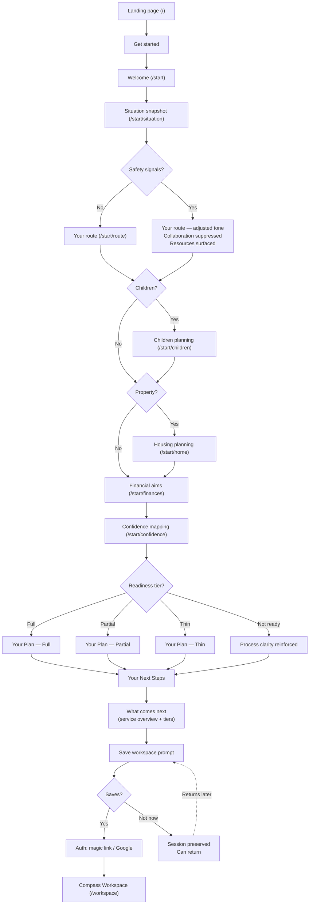
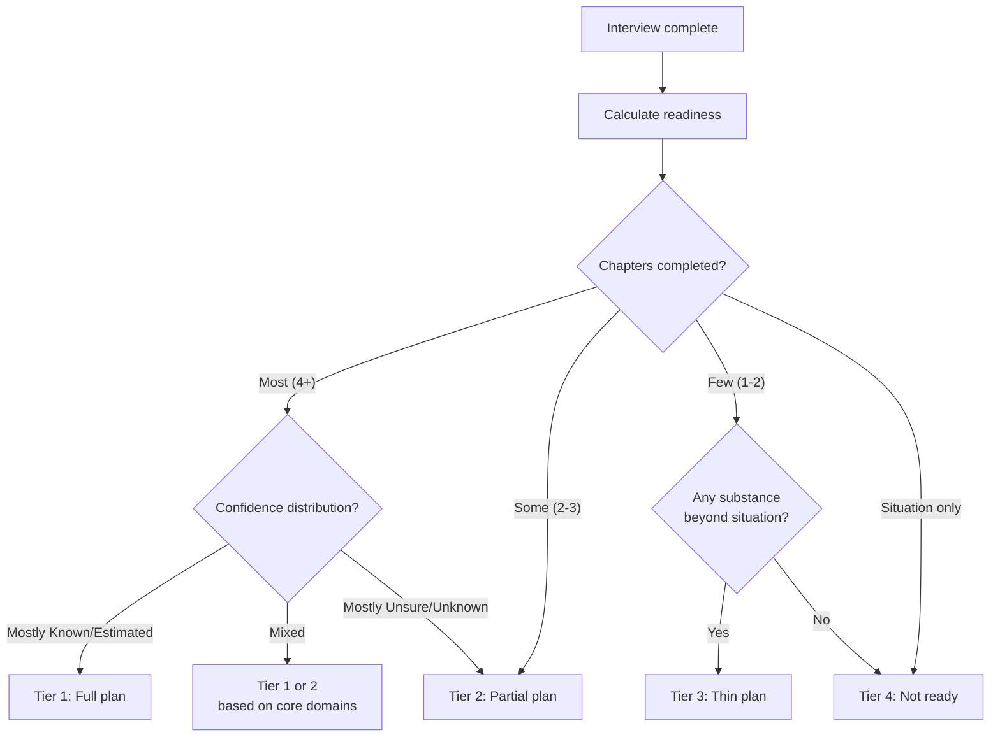
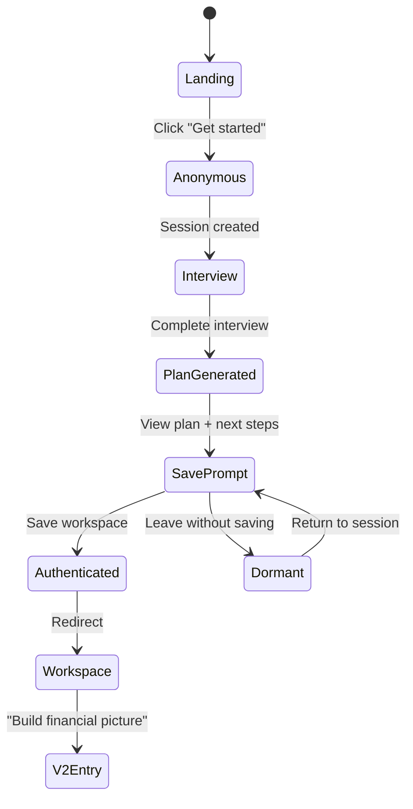

# V1 Diagrams and Wireframes

## User journey flow



## Adaptive output decision flow



## Gentle Interview → Compass Workspace transition

```mermaid
flowchart LR
    subgraph interview["Gentle Interview"]
        direction TB
        S1["Situation"] --> S2["Route"]
        S2 --> S3["Children"]
        S3 --> S4["Home"]
        S4 --> S5["Finances"]
        S5 --> S6["Confidence"]
        S6 --> S7["Plan"]
        S7 --> S8["Next Steps"]
    end

    subgraph transition["Save + Auth"]
        S8 --> AUTH["Magic link\nor Google"]
    end

    subgraph workspace["Compass Workspace"]
        direction TB
        RM["Route Map\n(sidebar)"]
        W1["Route card"]
        W2["Children cards"]
        W3["Housing cards"]
        W4["Finance cards"]
        W5["Confidence map"]
        W6["Plan summary"]
        W7["Next steps"]
        V2["V2 entry →"]
    end

    AUTH --> workspace
```



## Session state transitions



---

## ASCII wireframes

### Landing page (`/`)

```
┌─────────────────────────────────────────────────────┐
│  Decouple                          Features  Pricing│
├─────────────────────────────────────────────────────┤
│                                                     │
│              Separation doesn't have                │
│              to feel overwhelming.                  │
│                                                     │
│       Understand the process. Shape a plan.         │
│       Know what to do next.                         │
│                                                     │
│              ┌─────────────────┐                    │
│              │   Get started   │                    │
│              └─────────────────┘                    │
│          No sign-up needed. Takes ~25 min.          │
│                                                     │
├─────────────────────────────────────────────────────┤
│                                                     │
│  How it works                                       │
│                                                     │
│  ┌──────────┐  ┌──────────┐  ┌──────────┐          │
│  │  1. Tell  │  │ 2. See   │  │ 3. Get   │          │
│  │  us your  │  │ your     │  │ your     │          │
│  │  situation│  │ route    │  │ plan     │          │
│  └──────────┘  └──────────┘  └──────────┘          │
│                                                     │
├─────────────────────────────────────────────────────┤
│                                                     │
│  Your information is private and encrypted.         │
│  Nothing is shared unless you choose.               │
│                                                     │
├─────────────────────────────────────────────────────┤
│  Privacy · Terms · Cookies                          │
└─────────────────────────────────────────────────────┘
```

### Welcome screen (`/start`)

```
┌─────────────────────────────────────────────────────┐
│  Decouple                                           │
├─────────────────────────────────────────────────────┤
│                                                     │
│                                                     │
│        Let's build a clear picture of               │
│        where you are and what comes next.           │
│                                                     │
│                                                     │
│        In the next 20-30 minutes, you'll:           │
│                                                     │
│        ✓ See the likely process for your            │
│          specific situation                         │
│                                                     │
│        ✓ Shape a starting plan for children,        │
│          housing, and finances                      │
│                                                     │
│        ✓ Know exactly what to focus on next         │
│                                                     │
│                                                     │
│        You don't need to know everything.           │
│        You just need to start.                      │
│                                                     │
│              ┌─────────────────┐                    │
│              │   Let's begin   │                    │
│              └─────────────────┘                    │
│                                                     │
└─────────────────────────────────────────────────────┘
```

### Interview step — example: situation (`/start/situation`)

```
┌─────────────────────────────────────────────────────┐
│  ── ── ── ●─ ── ── ── ── ──    Step 1 of 8         │
├─────────────────────────────────────────────────────┤
│                                                     │
│        Your situation                               │
│                                                     │
│        Are you married or in a civil partnership?   │
│                                                     │
│        ┌─────────────┐  ┌─────────────┐            │
│        │   Married   │  │    Civil    │            │
│        │             │  │ partnership │            │
│        └─────────────┘  └─────────────┘            │
│        ┌─────────────┐  ┌─────────────┐            │
│        │  Cohabiting │  │    Other    │            │
│        │             │  │             │            │
│        └─────────────┘  └─────────────┘            │
│                                                     │
│        ┌ ─ ─ ─ ─ ─ ─ ─ ─ ─ ─ ─ ─ ─ ─ ┐           │
│          Why we ask: This helps us show             │
│        │ you the right process. Divorce  │          │
│          and dissolution have specific              │
│        │ legal steps.                    │          │
│        └ ─ ─ ─ ─ ─ ─ ─ ─ ─ ─ ─ ─ ─ ─ ┘           │
│                                                     │
│                                         Continue →  │
│                                                     │
└─────────────────────────────────────────────────────┘
```

### Confidence mapping (`/start/confidence`)

```
┌─────────────────────────────────────────────────────┐
│  ── ── ── ── ── ── ●─ ── ──    Step 7 of 8         │
├─────────────────────────────────────────────────────┤
│                                                     │
│        What do you know and not know?               │
│                                                     │
│        Most people have a mix. That's normal.       │
│                                                     │
│  ┌───────────────────────────────────────────┐      │
│  │  My income                    [ Known  ▾] │      │
│  ├───────────────────────────────────────────┤      │
│  │  Partner's income             [ Unsure ▾] │      │
│  ├───────────────────────────────────────────┤      │
│  │  Savings & bank accounts      [Estimated▾]│      │
│  ├───────────────────────────────────────────┤      │
│  │  Debts & loans                [ Known  ▾] │      │
│  ├───────────────────────────────────────────┤      │
│  │  Property value               [Estimated▾]│      │
│  ├───────────────────────────────────────────┤      │
│  │  Mortgage details             [ Known  ▾] │      │
│  ├───────────────────────────────────────────┤      │
│  │  My pension(s)                [ Unsure ▾] │      │
│  ├───────────────────────────────────────────┤      │
│  │  Partner's pension(s)         [Unknown ▾] │      │
│  ├───────────────────────────────────────────┤      │
│  │  Other assets                 [Unknown ▾] │      │
│  ├───────────────────────────────────────────┤      │
│  │  Regular commitments          [ Known  ▾] │      │
│  └───────────────────────────────────────────┘      │
│                                                     │
│        You can see where the gaps are — and         │
│        that's powerful information in itself.        │
│                                                     │
│                                         Continue →  │
└─────────────────────────────────────────────────────┘
```

### Your Plan — full tier (`/start/plan`)

```
┌─────────────────────────────────────────────────────┐
│  ── ── ── ── ── ── ── ●─ ──    Step 8 of 8         │
├─────────────────────────────────────────────────────┤
│                                                     │
│        Your plan                                    │
│                                                     │
│  ┌───────────────────────────────────────────┐      │
│  │  YOUR ROUTE                               │      │
│  │  Divorce → MIAM → Mediation likely →      │      │
│  │  Financial remedy → Consent order         │      │
│  │  Child arrangements to agree in parallel  │      │
│  └───────────────────────────────────────────┘      │
│                                                     │
│  ┌───────────────────────────────────────────┐      │
│  │  CHILDREN            Confidence: ● Strong │      │
│  │  You're aiming for roughly equal time,    │      │
│  │  keeping their school unchanged.          │      │
│  └───────────────────────────────────────────┘      │
│                                                     │
│  ┌───────────────────────────────────────────┐      │
│  │  HOUSING             Confidence: ◐ Mixed  │      │
│  │  You'd like to stay in the home. This     │      │
│  │  depends on the financial picture — the   │      │
│  │  next step will help clarify.             │      │
│  └───────────────────────────────────────────┘      │
│                                                     │
│  ┌───────────────────────────────────────────┐      │
│  │  FINANCES            Confidence: ○ Gaps   │      │
│  │  Fair split matters most. Pension and     │      │
│  │  partner's finances are unknowns.         │      │
│  └───────────────────────────────────────────┘      │
│                                                     │
│  ┌───────────────────────────────────────────┐      │
│  │  CONFIDENCE MAP                           │      │
│  │  Known: 4  Estimated: 2  Unsure: 2       │      │
│  │  Unknown: 2                               │      │
│  │  ████████████░░░░░░░░░░░░░░               │      │
│  └───────────────────────────────────────────┘      │
│                                                     │
│  ┌─────────────┐                                    │
│  │ Download PDF │                                   │
│  └─────────────┘                                    │
│                                                     │
│  You've built a strong starting position.           │
│                                         Continue →  │
└─────────────────────────────────────────────────────┘
```

### What comes next — service overview + commercial bridge (`/start/next`)

```
┌─────────────────────────────────────────────────────┐
│  ── ── ── ── ── ── ── ── ●─                        │
├─────────────────────────────────────────────────────┤
│                                                     │
│        Make your plan real                          │
│                                                     │
│        You've shaped a strong starting position.    │
│        Here's how Decouple helps you from here.     │
│                                                     │
│  BASED ON YOUR PLAN:                                │
│                                                     │
│  ┌────────────────────────────────────────────┐     │
│  │  Build the full picture                    │     │
│  │  You marked 4 items as Unknown or Unsure.  │     │
│  │  Build a detailed financial position,      │     │
│  │  deepen family arrangements, and upload    │     │
│  │  evidence — we'll extract and structure    │     │
│  │  the detail automatically.                 │     │
│  └────────────────────────────────────────────┘     │
│                                                     │
│  ┌────────────────────────────────────────────┐     │
│  │  Prepare for disclosure                    │     │
│  │  Turn your full picture into structured,   │     │
│  │  Form E-ready disclosure. Resolve open     │     │
│  │  questions. Link evidence to every claim.  │     │
│  └────────────────────────────────────────────┘     │
│                                                     │
│  ┌────────────────────────────────────────────┐     │
│  │  Share and negotiate                       │     │
│  │  Invite your partner, mediator, or         │     │
│  │  solicitor. Track proposals, counter-      │     │
│  │  proposals, and mediation progress.        │     │
│  │  Control exactly what they see.            │     │
│  └────────────────────────────────────────────┘     │
│                                                     │
│  ┌────────────────────────────────────────────┐     │
│  │  Reach agreement                           │     │
│  │  Resolve open points. Capture the final    │     │
│  │  agreed position. Get ready for            │     │
│  │  formalisation.                             │     │
│  └────────────────────────────────────────────┘     │
│                                                     │
│  ┌────────────────────────────────────────────┐     │
│  │  Prepare court documents      ✦ Enhanced   │     │
│  │  Generate draft consent orders, disclosure │     │
│  │  packs, and adviser-ready bundles directly │     │
│  │  from your structured case record.         │     │
│  └────────────────────────────────────────────┘     │
│                                                     │
├─────────────────────────────────────────────────────┤
│                                                     │
│  CHOOSE HOW TO CONTINUE                             │
│                                                     │
│  ┌──────────────────┐  ┌──────────────────┐         │
│  │    Standard       │  │    Enhanced      │         │
│  │                   │  │                  │         │
│  │  Full picture     │  │  Everything in   │         │
│  │  Disclosure       │  │  Standard, plus: │         │
│  │  Sharing &        │  │                  │         │
│  │  negotiation      │  │  Draft court     │         │
│  │  Reach agreement  │  │  documents       │         │
│  │                   │  │  Additional      │         │
│  │  £X/case          │  │  support         │         │
│  │                   │  │                  │         │
│  │  [Choose]         │  │  £X/case         │         │
│  │                   │  │                  │         │
│  └──────────────────┘  │  [Choose]         │         │
│                         │                  │         │
│                         └──────────────────┘         │
│                                                     │
│  You can upgrade from Standard to Enhanced          │
│  at any time.                                       │
│                                                     │
│  Not ready to decide? Save your workspace for       │
│  free and explore when you're ready.                │
│                                                     │
│           ┌──────────────────────┐                  │
│           │  Save workspace free │                  │
│           └──────────────────────┘                  │
│                                                     │
└─────────────────────────────────────────────────────┘
```

### Compass Workspace (`/workspace`) — desktop

The route map reflects the real journey ahead, not the interview steps.
V1 interview answers become the starting state that gets deepened.

```
┌──────────────────────────────────────────────────────────────────┐
│  Decouple                                       Profile  ⚙  💬  │
├──────────────┬───────────────────────────────────────────────────┤
│              │                                                   │
│  YOUR        │  YOUR WORKSPACE                                   │
│  JOURNEY     │                                                   │
│              │  ┌─────────────────────────────────────────────┐  │
│  ✓ Understand│  │  YOUR PLAN              [View] [Download]   │  │
│    your      │  │  Route clear · 3 areas started · 4 unknown  │  │
│    situation │  └─────────────────────────────────────────────┘  │
│              │                                                   │
│  ● Build the │  ─── BUILD THE FULL PICTURE ──────────────────── │
│    full      │                                                   │
│    picture   │  Tasks                                   3 of 12  │
│    ├ Finances│  ┌─────────────────────────────────────────────┐  │
│    ├ Family  │  │  ☐ Detail your income and employment       │  │
│    ├ Evidence│  │  ☐ Detail your partner's income (estimated) │  │
│    └ Gaps    │  │  ☐ List all bank accounts and savings      │  │
│              │  │  ☐ List all debts and loans                │  │
│  ○ Prepare   │  │  ☐ Get a property valuation or estimate    │  │
│    for       │  │  ☐ Detail mortgage position                │  │
│    disclosure│  │  ☐ Investigate your pension value           │  │
│              │  │  ☐ Investigate partner's pension            │  │
│  ○ Share &   │  │  ☐ Detail children's arrangements fully    │  │
│    negotiate │  │  ☐ Upload supporting documents              │  │
│              │  │  ☐ Link evidence to financial items         │  │
│  ○ Reach     │  │  ☐ Review and confirm all estimates        │  │
│    agreement │  └─────────────────────────────────────────────┘  │
│              │                                                   │
│  ○ Prepare   │  ─── STARTING POSITION (from your plan) ──────── │
│    court     │                                                   │
│    documents │  ┌──────────────────┐  ┌──────────────────┐      │
│    ✦ Enhanced│  │ Children: equal  │  │ Home: stay       │      │
│              │  │ time aim         │  │ ◐ Estimated      │      │
│              │  │ ● Known   [Edit] │  │ [Edit]           │      │
│              │  └──────────────────┘  └──────────────────┘      │
│              │  ┌──────────────────┐  ┌──────────────────┐      │
│              │  │ Fair split       │  │ Pension: unknown │      │
│              │  │ priority         │  │ ○ Unknown        │      │
│              │  │ [Edit]           │  │ [Edit]           │      │
│              │  └──────────────────┘  └──────────────────┘      │
│              │                                                   │
│              │  ┌─────────────────────────────────────────────┐  │
│              │  │  CONFIDENCE MAP                             │  │
│              │  │  Known: 4  Estimated: 2  Unsure: 2         │  │
│              │  │  Unknown: 2                                 │  │
│              │  │  ████████████░░░░░░░░░░░░░░                 │  │
│              │  └─────────────────────────────────────────────┘  │
│              │                                                   │
├──────────────┴───────────────────────────────────────────────────┤
│  Privacy · Terms · Support                                       │
└──────────────────────────────────────────────────────────────────┘
```

### Compass Workspace — mobile

```
┌──────────────────────────┐
│ Decouple          ☰  👤  │
├──────────────────────────┤
│ Phase: Build full picture│
│ ████░░░░░░░░  3/12 tasks │
├──────────────────────────┤
│                          │
│ ┌──────────────────────┐ │
│ │ YOUR PLAN     [View] │ │
│ │ Route · 3 areas · 4? │ │
│ └──────────────────────┘ │
│                          │
│ ── CURRENT TASKS ─────── │
│ ┌──────────────────────┐ │
│ │ ☐ Detail income      │ │
│ │ ☐ List bank accounts │ │
│ │ ☐ Property estimate  │ │
│ │ ☐ Investigate pension│ │
│ │     + 8 more         │ │
│ └──────────────────────┘ │
│                          │
│ ── STARTING POSITION ─── │
│ ┌──────────────────────┐ │
│ │ Children: equal time │ │
│ │ ● Known       [Edit] │ │
│ └──────────────────────┘ │
│ ┌──────────────────────┐ │
│ │ Home: stay           │ │
│ │ ◐ Estimated   [Edit] │ │
│ └──────────────────────┘ │
│ ┌──────────────────────┐ │
│ │ Pension: unknown     │ │
│ │ ○ Unknown     [Edit] │ │
│ └──────────────────────┘ │
│                          │
│ ┌──────────────────────┐ │
│ │ CONFIDENCE MAP       │ │
│ │ ████████░░░░  6/10   │ │
│ └──────────────────────┘ │
│                          │
└──────────────────────────┘
```

### Journey map states — how the sidebar evolves

The journey sidebar is not static. It evolves as the user progresses:

**On first entry (post V1):**
```
✓ Understand your situation
● Build the full picture ← active, expanded
  ├ Finances (3/12)
  ├ Family (0/4)
  ├ Evidence (0/8)
  └ Gaps (6 remaining)
○ Prepare for disclosure
○ Share & negotiate
○ Reach agreement
○ Prepare court documents ✦
```

**Mid-progress (V2/V3 work underway):**
```
✓ Understand your situation
✓ Build the full picture
● Prepare for disclosure ← active, expanded
  ├ Form E sections (7/12)
  ├ Open questions (3 raised)
  ├ Evidence linked (14/18)
  └ Readiness: 65%
○ Share & negotiate
○ Reach agreement
○ Prepare court documents ✦
```

**Later (V4 work underway):**
```
✓ Understand your situation
✓ Build the full picture
✓ Prepare for disclosure
● Share & negotiate ← active, expanded
  ├ Respondent invited ✓
  ├ Mediator: adjacent mode
  ├ Proposals: v3 (2 disputed)
  ├ Next session: 14 Apr
  └ Agreed: 8/12 points
○ Reach agreement
○ Prepare court documents ✦
```
